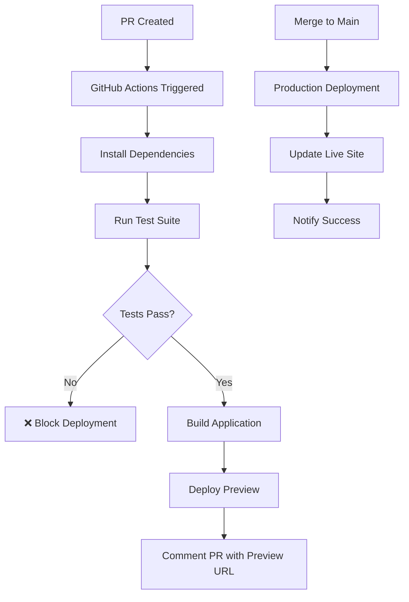

# Setup GitHub Actions CI/CD for automated Firebase deployment

## Problem Statement
Currently deployment requires manual steps (`npm run deploy:hosting`) which is error-prone and doesn't follow modern DevOps practices. Need automated deployment pipeline that:
- Deploys on merge to main branch
- Creates preview deployments for PRs
- Runs full test suite before deployment
- Provides rollback capabilities

## Design Overview

### Architecture


### Workflow Design (TDD Approach)

#### 1. Test-First Documentation
Create `.github/workflows/ci-cd.yml` with comprehensive test coverage:
- Unit tests must pass (npm run test:unit)
- E2E tests must pass (npm run test:e2e) 
- Build must succeed (npm run build)
- Firebase rules validation (firebase deploy --only firestore:rules --dry-run)

#### 2. Preview Environment Strategy
- **Feature branches**: Deploy to preview channels
- **Main branch**: Deploy to production hosting
- **Preview URLs**: `https://notecards-1b054--pr-123-[commit].web.app`

#### 3. Security & Secrets Management
- Use Firebase service account (stored in GitHub Secrets)
- Environment-specific configurations
- Secure token handling for deployment

## Implementation Plan

### Phase 1: Foundation (TDD Documentation)
- [ ] **Test**: Write workflow test scenarios in `docs/ci-cd/test-scenarios.md`
- [ ] **Test**: Define expected behavior for PR previews, main deployments, failures
- [ ] **Red**: Create placeholder workflow file that validates test scenarios
- [ ] **Green**: Implement basic workflow structure

### Phase 2: Core Workflow Implementation
- [ ] **Test**: Create mock Firebase project for testing deployments
- [ ] **Test**: Write GitHub Actions workflow validation script
- [ ] **Red**: Implement PR preview deployment workflow
- [ ] **Green**: Make PR previews work end-to-end
- [ ] **Refactor**: Optimize workflow performance and error handling

### Phase 3: Production Deployment
- [ ] **Test**: Document production deployment test cases
- [ ] **Red**: Implement main branch auto-deployment
- [ ] **Green**: Ensure production deployments work reliably
- [ ] **Test**: Add rollback mechanism testing

### Phase 4: Enhanced Features
- [ ] **Test**: Define cache optimization test cases
- [ ] **Green**: Implement workflow caching (node_modules, build artifacts)
- [ ] **Test**: Create notification system tests
- [ ] **Green**: Add Slack/Discord deployment notifications
- [ ] **Refactor**: Performance optimization and monitoring

## Technical Specifications

### Required GitHub Secrets
```yaml
FIREBASE_SERVICE_ACCOUNT: JSON service account key
FIREBASE_PROJECT_ID: notecards-1b054
SLACK_WEBHOOK_URL: (optional) for notifications
```

### Workflow Triggers
```yaml
on:
  push:
    branches: [main]
  pull_request:
    branches: [main]
  workflow_dispatch: # Manual trigger
```

### Test Integration Strategy
```yaml
- name: Run Test Suite
  run: |
    npm ci
    npm run test:unit -- --coverage
    npm run test:e2e:ci
    npm run build
    npm run test:rules
```

## Docs-as-Code Implementation

### 1. Workflow Documentation (`docs/ci-cd/`)
- [ ] `deployment-guide.md` - Step-by-step deployment process
- [ ] `troubleshooting.md` - Common issues and solutions  
- [ ] `rollback-procedures.md` - Emergency rollback steps
- [ ] `test-scenarios.md` - Comprehensive test cases for CI/CD

### 2. Configuration Documentation
- [ ] Environment variable documentation
- [ ] Secret management procedures
- [ ] Firebase project setup guide

### 3. Monitoring Documentation
- [ ] Deployment health checks
- [ ] Performance monitoring setup
- [ ] Error alerting configuration

## Acceptance Criteria

### ✅ Must Have
- [ ] **Automated PR Previews**: Every PR gets unique preview URL
- [ ] **Production Auto-Deploy**: Main branch merges auto-deploy to production
- [ ] **Test Gate**: Deployments blocked if any tests fail
- [ ] **Build Validation**: TypeScript compilation and Vite build must succeed
- [ ] **Security**: Service account properly configured, no secrets in code
- [ ] **Documentation**: Complete docs-as-code in `docs/ci-cd/`

### ✅ Should Have  
- [ ] **Performance**: Workflow completes in <5 minutes
- [ ] **Caching**: Dependencies cached between runs
- [ ] **Notifications**: Deployment status posted to PR comments
- [ ] **Rollback**: Manual rollback capability through GitHub UI
- [ ] **Monitoring**: Basic deployment health checks

### ✅ Could Have
- [ ] **Slack Integration**: Deployment notifications to team channel
- [ ] **Staged Rollouts**: Canary deployments for large changes
- [ ] **Performance Metrics**: Build time and bundle size tracking
- [ ] **Multi-Environment**: Staging environment for complex testing

## Testing Strategy (TDD Approach)

### 1. Workflow Testing
```bash
# Test workflow syntax
act --list

# Test PR preview deployment
act pull_request -j preview-deploy

# Test production deployment
act push -j production-deploy
```

### 2. Integration Testing
- [ ] Deploy test app to verify workflow
- [ ] Test with failing tests (should block deployment)
- [ ] Test with successful tests (should deploy)
- [ ] Test rollback procedures

### 3. Documentation Testing
- [ ] Verify all commands in docs work
- [ ] Test troubleshooting procedures
- [ ] Validate rollback steps

## Security Considerations

### Service Account Permissions
```json
{
  "firebase": [
    "Firebase Hosting Admin",
    "Cloud Firestore Index Admin", 
    "Firebase Rules Admin"
  ],
  "scope": "project-level"
}
```

### Secrets Management
- Store Firebase service account as GitHub Secret
- Use environment-specific configurations
- Never commit secrets to repository
- Regular rotation of service account keys

## Success Metrics

### Performance Targets
- Workflow completion time: <5 minutes
- Time to deployment after merge: <3 minutes
- Test execution time: <2 minutes
- Build time: <1 minute

### Reliability Targets  
- Deployment success rate: >99%
- False positive test failures: <1%
- Rollback time (if needed): <2 minutes

## Resources & References

### Documentation
- [GitHub Actions Firebase Deploy](https://github.com/marketplace/actions/deploy-to-firebase-hosting)
- [Firebase CLI GitHub Action](https://github.com/FirebaseExtended/action-hosting-deploy)
- [TDD for Infrastructure](https://docs.github.com/en/actions/learn-github-actions)

### Tools
- `act` for local workflow testing
- Firebase CLI for deployment validation
- GitHub CLI for workflow management

## Definition of Done

### Code Complete
- [ ] GitHub Actions workflow file created and tested
- [ ] Service account configured with minimal permissions
- [ ] All tests integrated into pipeline
- [ ] Documentation complete and validated

### Testing Complete
- [ ] Workflow tested with `act` locally
- [ ] PR preview deployment verified
- [ ] Production deployment verified
- [ ] Rollback procedure tested
- [ ] All documentation commands verified

### Production Ready
- [ ] Deployed to production and verified working
- [ ] Team trained on new workflow
- [ ] Monitoring and alerting configured
- [ ] Incident response procedures documented

---

## Implementation Notes

This card follows TDD principles by:
1. **Test-First**: Define expected behavior before implementation
2. **Red-Green-Refactor**: Implement incrementally with failing → passing → optimize cycles  
3. **Docs-as-Code**: All procedures documented and version controlled
4. **Automated Testing**: Pipeline tests itself and provides confidence

The implementation prioritizes reliability, security, and developer experience while following modern DevOps practices.