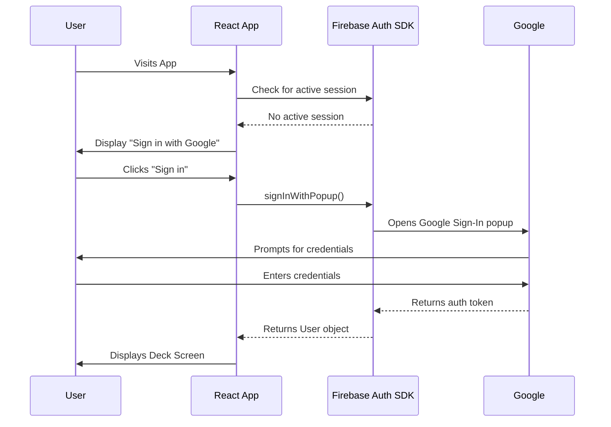
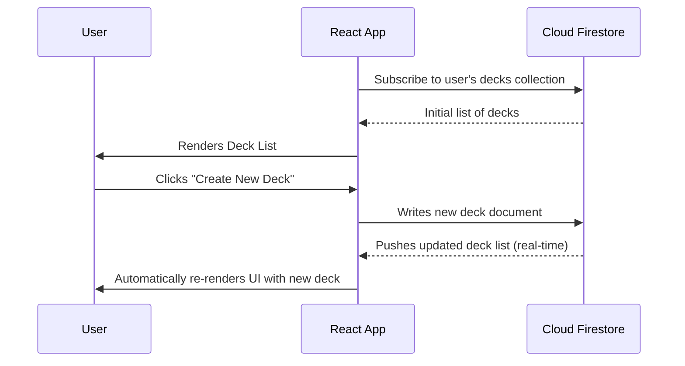

# Notecard App - Engineering Design Document

## 1.0 Overview

### 1.1 Objective
This document provides a detailed technical blueprint for the engineering team to build the Proof of Concept (POC) for the Notecard application. It defines the system architecture, component structure, data models, and key implementation strategies. The goal is to align the development team on how the product will be built, ensuring a consistent and efficient development process.

### 1.2 Background
This engineering design is based on the features and requirements outlined in the Notecard App - Product Requirements Document (PRD). The PRD specifies the what and why of the project, while this document details the how.

### 1.3 Technical Stack Summary
*   **Frontend:** React with TypeScript
*   **Styling:** Tailwind CSS
*   **Backend-as-a-Service (BaaS):** Google Firebase
*   **Database:** Cloud Firestore
*   **Authentication:** Firebase Authentication (Google Sign-In)
*   **Hosting:** Firebase Hosting

### 1.4 Assumptions & Constraints
**Assumptions:**
*   The primary target platform is modern web browsers on mobile and desktop devices.
*   The development team has a working knowledge of React, TypeScript, and Firebase.
*   For the POC, a single-user experience is sufficient; real-time collaboration is out of scope.

**Constraints:**
*   All development must operate within the limits of the Firebase "Spark Plan" (free tier) to manage costs.
*   The feature set is strictly limited to what is defined in the PRD to ensure a rapid POC delivery.
*   Third-party libraries will be kept to a minimum to reduce complexity and bundle size.

## 2.0 System Architecture

### 2.1 High-Level Diagram
The application follows a classic client-server model, leveraging Firebase as a comprehensive Backend-as-a-Service (BaaS). The client-side React application, served via Firebase Hosting, interacts directly with Firebase's authentication and database services, eliminating the need for a custom server-side application layer.

```mermaid
graph TD
    subgraph User Device
        A[Browser]
    end

    subgraph Firebase Hosting
        B[React App (Static JS/HTML/CSS)]
    end

    subgraph Google Cloud Platform
        C[Firebase Authentication]
        D[Cloud Firestore Database]
    end

    A -- Loads App --> B
    B -- Handles Auth --> C
    B -- Reads/Writes Data --> D
```

### 2.2 Data Flow

#### 2.2.1 User Authentication Flow
The authentication process is handled entirely by the Firebase Authentication SDK on the client side. The application gates access to its core features, ensuring a user is logged in before they can view or manage their decks.



#### 2.2.2 Data Read/Write Flow (Real-time Sync)
Data interaction is designed around Firestore's real-time capabilities. The application subscribes to data collections and automatically receives updates when the data changes in the backend, providing a seamless and responsive user experience.



## 3.0 Frontend Architecture (React + TypeScript)

### 3.1 Component Hierarchy
The application's UI will be broken down into a logical hierarchy of reusable components.

*   **3.1.1 App.tsx:** The root component. It will manage client-side routing (e.g., between the deck and card screens) and act as an authentication guard, redirecting unauthenticated users to a login page.
*   **3.1.2 DeckScreen.tsx:** A container component that fetches and displays the list of the user's decks. It will manage the state for the deck list and handle the creation of new decks.
*   **3.1.3 DeckListItem.tsx:** A presentational component that represents a single deck in the list. It will display the deck's title and contain the UI for the "Rename" and "Delete" actions.
*   **3.1.4 CardScreen.tsx:** A container component that fetches and displays the cards for a specific deck. It will manage the state for the card list, handle all group actions (Filter, Shuffle, etc.), and contain the logic for the drag-and-drop context.
*   **3.1.5 CardListItem.tsx:** A stateful component representing a single collapsible card. It will manage its own expanded/collapsed state and handle the in-place editing of its title and body content.

### 3.2 State Management
The state management strategy will be kept simple and localized to avoid unnecessary complexity for the POC.

*   **3.2.1 Component-Local State:** The `useState` and `useReducer` hooks will be the primary tools for managing UI state (e.g., the open/closed state of a modal, the value of a text input) within the components where that state is relevant.
*   **3.2.2 Global State (React Context):** React Context will be used for one specific purpose: providing the current authentication status and user object to the entire component tree. This avoids "prop drilling" the user data down to every component that needs it. A custom `useAuth` hook will be created to easily access this context.

### 3.3 Key Libraries & Rationale
*   **3.3.1 UI Framework: React:** Chosen for its component-based architecture, strong community support, and rich ecosystem, which...

```
|-- /components       # Reusable UI components (e.g., Button, Modal)
|-- /features         # Feature-based components (e.g., /decks, /cards)
|-- /firebase         # Firebase configuration and initialization
|-- /hooks            # Custom React hooks (e.g., useAuth)
|-- /lib              # Helper/utility functions
|-- /providers        # React Context providers (e.g., AuthProvider)
|-- /types            # TypeScript type definitions and interfaces
|-- App.tsx           # Root application component
|-- main.tsx          # Application entry point
```

## 4.0 Backend Architecture (Firebase)

### 4.1 Firestore Data Models
The database schema is designed to be scalable and secure, leveraging sub-collections to organize nested data.

#### 4.1.1 `users` Collection:
Stores a document for each user who signs up. The document ID will be the user's Firebase Auth UID.

*   `users/{userId}`
    *   `email`: (string) User's email address.
    *   `displayName`: (string) User's display name.
    *   `createdAt`: (timestamp) Server timestamp of account creation.

#### 4.1.2 `decks` Collection:
Stores a document for each deck created by any user.

*   `decks/{deckId}`
    *   `title`: (string) The title of the deck.
    *   `ownerId`: (string) The UID of the user who owns the deck.
    *   `createdAt`: (timestamp) Server timestamp of deck creation.

#### 4.1.3 `cards` Sub-collection:
A sub-collection within each deck document, containing the cards for that deck.

*   `decks/{deckId}/cards/{cardId}`
  *   `title`: (string) The title of the card (the "front").
  *   `body`: (string) The content of the card (the "back").
  *   `orderIndex`: (number) A numerical value used for sorting the cards.
  *   `favorite` (boolean, optional): Post-POC enhancement flag for prioritization / filtering.
  *   `archived` (boolean, optional): Post-POC enhancement flag; archived cards excluded from default list (future UX toggle) but retained for history.

#### 4.1.4 `orderSnapshots` Sub-collection:
A sub-collection within each deck document for storing named order snapshots.

*   `decks/{deckId}/orderSnapshots/{snapshotId}`
    *   `name`: (string) The user-provided name for the snapshot.
    *   `cardOrder`: (array of strings) An array containing the ordered list of cardIds.

### 4.2 Firestore Security Rules
The security rules are critical for protecting user data. They will be deployed to Firebase to enforce access control on the server side.

```
rules_version = '2';
service cloud.firestore {
  match /databases/{database}/documents {

    // Users can only see their own user document.
    match /users/{userId} {
      allow read, write: if request.auth != null && request.auth.uid == userId;
    }

    // Decks can be read, created, updated, or deleted only by the owner.
    match /decks/{deckId} {
      allow read, delete, update: if request.auth != null && resource.data.ownerId == request.auth.uid;
      allow create: if request.auth != null && request.resource.data.ownerId == request.auth.uid;

      // Cards can be accessed only if the user has access to the parent deck.
      match /cards/{cardId} {
        allow read, write, delete: if request.auth != null && get(/databases/$(database)/documents/decks/$(deckId)).data.ownerId == request.auth.uid;
      }

      // Order snapshots follow the same rules as cards.
      match /orderSnapshots/{snapshotId} {
        allow read, write, delete: if request.auth != null && get(/databases/$(database)/documents/decks/$(deckId)).data.ownerId == request.auth.uid;
      }
    }
  }
}
```

### 4.3 Firebase Service Layer
To keep the component logic clean and abstract away direct SDK calls, we will create a dedicated service layer.

*   **4.3.1 auth.ts:** This file will export functions for handling the authentication lifecycle, such as `signInWithGoogle`, `signOut`, and a function to listen for auth state changes.
*   **4.3.2 firestore.ts:** This file will export a set of asynchronous functions for all database interactions (CRUD - Create, Read, Update, Delete). For example: `createDeck(userId, title)`, `getDecks(userId)`, `updateCardContent(deckId, cardId, newContent)`, etc. This centralizes data logic and makes it easier to manage and test.

## 5.0 Key Feature Implementation Details

### 5.1 Drag-and-Drop Reordering

*   **5.1.1 Logic for `onDragEnd` callback:** The `onDragEnd` function provided by `react-beautiful-dnd` will be the trigger for persisting order changes. The function will first update the local React state immediately to provide instant visual feedback to the user.
*   **5.1.2 Batch-writing `orderIndex` updates to Firestore:** After the local state is updated, the function will calculate the new `orderIndex` for all cards affected by the drag operation. To ensure data integrity and minimize Firestore writes, these updates will be executed as a single batched write. This atomic operation guarantees that either all `orderIndex` updates succeed or they all fail, preventing the card list from entering a corrupted state.

### 5.2 Order Snapshot Feature

*   **5.2.1 Data model for storing an array of card IDs:** As defined in 4.1.4, a snapshot is simply a document containing a name and an array of `cardId` strings. This is a lightweight and efficient way to store an order without duplicating card content.
*   **5.2.2 Client-side logic for re-sorting:** When a user loads a snapshot, the application will:
  *   Fetch the `cardOrder` array from the selected snapshot document.
  *   Use this array to re-sort the existing card data held in the local React state. The client will map over the `cardOrder` array and arrange the corresponding card objects into a new array. (Implementation deferred; design retained.)

### 5.3 Post-POC Enhancements (Implemented)
The following features were added after initial POC completion via strict TDD:
* **Duplicate Card:** Hook method creates a shallow copy of a card (title/body/favorite state excluding archived) with a new ID and orderIndex (current: appended; improvement: insert directly after original using fractional orderIndex or reindex routine).
* **Favorite Toggle:** Adds/removes `favorite` flag; tests verify button wiring and state persistence layer integration.
* **Archive Toggle:** Sets `archived` flag; archived cards remain in collection. Future filtering layer will hide by default.

### 5.4 Hook Architecture Updates
`useCardOperations` now exposes:
```
createCard, updateCard, deleteCard,
moveCardUp, moveCardDown, reorderCards,
duplicateCard, toggleFavorite, archiveCard, unarchiveCard
```
Design Considerations:
* Centralized error & loading state per operation for consistent UI feedback.
* Optional flags preserved on updates; undefined fields not overwritten.
* Future extension point: optimistic updates with rollback queue for real-time collaboration.

### 5.5 Data Integrity & Ordering Strategy
Current approach maintains contiguous integer `orderIndex` values. Upcoming improvements may adopt:
* **Fractional Insertion:** Insert new or duplicated card between existing indices (e.g., 10 and 11 -> 10.5) then periodic normalization.
* **Gap Strategy:** Allocate indices in increments (e.g., 100, 200, 300) to allow mid-insert without immediate renumber.
Decision pending based on drag-and-drop implementation ergonomics; tracker will record chosen approach.

### 5.6 Planned Technical Enhancements
| Area | Planned Improvement | Rationale |
|------|---------------------|-----------|
| Filtering | Client-side derived selector + memoization | Performance with 500+ cards |
| Drag-and-Drop | Migrate to react-beautiful-dnd | Accessible, testable reorder UX |
| Snapshots | Minimal save/load first | Avoid premature complexity |
| Duplicate Placement | Fractional or gap indices | Maintain adjacency semantics |
| Archived Handling | Default hide toggle + count badge | Reduce clutter |

### 5.7 Testing Strategy Addendum
Each new enhancement introduced: failing test -> minimal implementation -> refactor. Coverage includes:
* Hook unit tests asserting Firestore interaction calls & state transitions.
* UI integration tests asserting button presence (`aria-label` patterns like `duplicate <id>`), click behavior, and list updates.
* Negative path tests (error simulation) for robustness (favorite/archive toggles).

Revision Note (2025-09-01): Added favorite / archived flags, duplicate operation, and ordering improvement plan.
