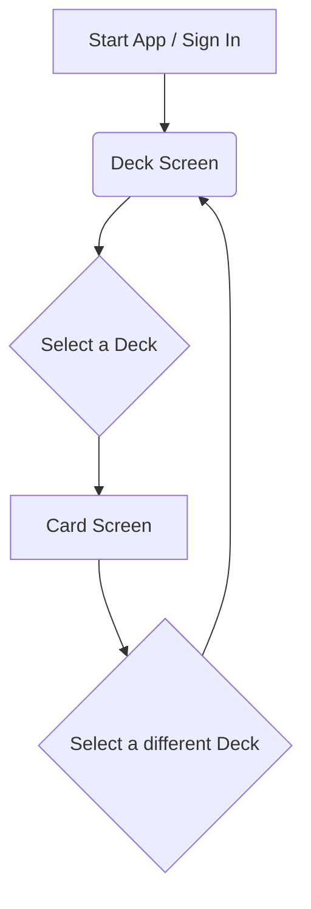

# Notecard App - Product Requirements Document (PRD)

## 1.0 Introduction

### 1.1 Vision & Mission
**Vision:** To create the most intuitive and flexible digital environment for thinking, learning, and creating.

**Mission:** We are building a web application that digitizes the power and simplicity of the classic 3x5 index card system. Our mission is to provide students, writers, and creators with a tool that helps them capture, organize, and connect ideas as fluidly as they would on a physical desk, but with the added benefits of digital technology.

### 1.2 Problem Statement
Modern productivity tools are often too rigid or too complex. Word processors enforce a linear, top-to-bottom structure, while complex project management apps require significant setup. This leaves a gap for a tool designed specifically for the messy, non-linear process of early-stage thinking, learning, and planning.

Knowledge workers need a space where they can quickly capture individual thoughts, visually group related concepts, and effortlessly restructure information without being constrained by the format of a final document.

### 1.3 Target Audience & User Personas
Our primary audience consists of individuals who need to organize information and structure narratives.

*   **The Student:** High school and college students who need to study for exams, memorize concepts, and outline research papers.
*   **The Writer:** Novelists, screenwriters, and content creators who need to brainstorm plot points, structure scenes, and organize narrative arcs.
*   **The Project Planner:** Project managers, consultants, and solo entrepreneurs who need to break down complex projects into tasks, brainstorm campaign ideas, and visualize workflows.

### 1.4 Scope for Proof of Concept (POC)
This document primarily defines the requirements for a focused Proof of Concept (POC). The goal of the POC is to validate the core user experience: creating and organizing text-based notes within a deck.

The POC will be a single-user experience, intentionally postponing collaboration, rich media,...

### 2.2.2 Wireframe: Deck Screen
*   **Layout:** A single-column, mobile-first list.
*   **Header:** Contains the app title ("Notecard") and a user profile/logout icon.
*   **Main Content:** A scrollable list of all existing decks. Each item in the list displays the deck's title. Tapping a deck navigates to the Card Screen.
*   **Actions:**
    *   A prominent floating action button (FAB) in the bottom-right corner with a `+` icon to create a new deck.
    *   Each deck item has a "more" (three dots) icon that opens a small menu with "Rename" and "Delete" options.

### 2.2.3 Wireframe: Card Screen (Collapsed & Expanded States)
*   **Layout:** A single-column, mobile-first list.
*   **Header:** Displays the title of the current deck, a back arrow to return to the Deck Screen, and a "more" icon for group actions.
*   **Group Actions Bar:** Directly below the header, this area contains:
    *   A "Filter" text input field.
    *   Buttons for "Collapse All," "Expand All," and "Shuffle."
    *   A dropdown menu for the "Order Snapshot" feature (Save Order As..., Load Order).
*   **Main Content (Card List):**
    *   **Collapsed State (Default):** Each card is represented by a single row showing its title and a drag handle. This view is optimized for reordering and getting a high-level overview.
    *   **Expanded State:** Tapping a card expands it in-place, revealing a larger text area for the body/content. The card's header (containing the title and collapse button) will remain sticky at the top of the viewport as the user scrolls through the body content. If multiple cards are expanded, this creates the effect of a single, continuous document with sticky section headers that can be easily collapsed.
*   **Actions:**
    *   A `+ New Card` button is anchored at the bottom of the list.

## 3.0 Product Features - Proof of Concept (POC)
This section details the specific features required to build the POC.

### 3.1 Deck Screen (Home Screen)
*   **3.1.1 View All Decks:** The user can see a list of all decks they have created.
*   **3.1.2 Create New Deck:** The user can create a new, empty deck. The app will prompt for a title and then add it to the deck list.
*   **3.1.3 Rename Dec...**
