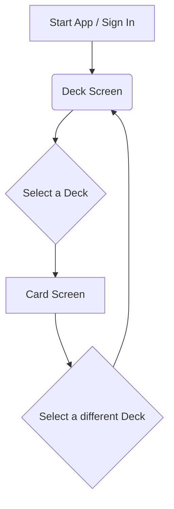

# Notecard App - Product Requirements Document (PRD)

## 1.0 Introduction

### 1.1 Vision & Mission
**Vision:** To create the most intuitive and flexible digital environment for thinking, learning, and creating.

**Mission:** We are building a web application that digitizes the power and simplicity of the classic 3x5 index card system. Our mission is to provide students, writers, and creators with a tool that helps them capture, organize, and connect ideas as fluidly as they would on a physical desk, but with the added benefits of digital technology.

### 1.2 Problem Statement
Modern productivity tools are often too rigid or too complex. Word processors enforce a linear, top-to-bottom structure, while complex project management apps require significant setup. This leaves a gap for a tool designed specifically for the messy, non-linear process of early-stage thinking, learning, and planning.

Knowledge workers need a space where they can quickly capture individual thoughts, visually group related concepts, and effortlessly restructure information without being constrained by the format of a final document.

### 1.3 Target Audience & User Personas
Our primary audience consists of individuals who need to organize information and structure narratives.

*   **The Student:** High school and college students who need to study for exams, memorize concepts, and outline research papers.
*   **The Writer:** Novelists, screenwriters, and content creators who need to brainstorm plot points, structure scenes, and organize narrative arcs.
*   **The Project Planner:** Project managers, consultants, and solo entrepreneurs who need to break down complex projects into tasks, brainstorm campaign ideas, and visualize workflows.

### 1.4 Scope for Proof of Concept (POC)
This document primarily defines the requirements for a focused Proof of Concept (POC). The goal of the POC is to validate the core user experience: creating and organizing text-based notes within a deck.

The POC will be a single-user experience, intentionally postponing collaboration, rich media,...

### 2.2.2 Wireframe: Deck Screen
*   **Layout:** A single-column, mobile-first list.
*   **Header:** Contains the app title ("Notecard") and a user profile/logout icon.
*   **Main Content:** A scrollable list of all existing decks. Each item in the list displays the deck's title. Tapping a deck navigates to the Card Screen.
*   **Actions:**
    *   A prominent floating action button (FAB) in the bottom-right corner with a `+` icon to create a new deck.
    *   Each deck item has a "more" (three dots) icon that opens a small menu with "Rename" and "Delete" options.

### 2.2.3 Wireframe: Card Screen (Collapsed & Expanded States)
*   **Layout:** A single-column, mobile-first list.
*   **Header:** Displays the title of the current deck, a back arrow to return to the Deck Screen, and a "more" icon for group actions.
*   **Group Actions Bar:** Directly below the header, this area contains:
    *   A "Filter" text input field.
    *   Buttons for "Collapse All," "Expand All," and "Shuffle."
    *   A dropdown menu for the "Order Snapshot" feature (Save Order As..., Load Order).
*   **Main Content (Card List):**
    *   **Collapsed State (Default):** Each card is represented by a single row showing its title and a drag handle. This view is optimized for reordering and getting a high-level overview.
    *   **Expanded State:** Tapping a card expands it in-place, revealing a larger text area for the body/content. The card's header (containing the title and collapse button) will remain sticky at the top of the viewport as the user scrolls through the body content. If multiple cards are expanded, this creates the effect of a single, continuous document with sticky section headers that can be easily collapsed.
*   **Actions:**
    *   A `+ New Card` button is anchored at the bottom of the list.

## 3.0 Product Features - Proof of Concept (POC)
This section details the specific features required to build the POC (implemented) plus post-POC incremental enhancements already delivered via strict TDD.

### 3.1 Deck Screen (Home Screen)
* **3.1.1 View All Decks (Implemented):** The user can see a list of all decks they have created.
* **3.1.2 Create New Deck (Implemented):** The user can create a new, empty deck. The app prompts for a title then adds it to the list.
* **3.1.3 Rename Deck (In Progress / Partial):** UI affordance exists; persistent rename still being finalized (Firestore integration refinement pending if not already merged).
* **3.1.4 Delete Deck (In Progress / Partial):** Confirmation UI present; ensure Firestore delete + optimistic update consistency.
* **3.1.5 Navigation to Card Screen (Implemented):** Selecting a deck loads its cards.

### 3.2 Card Screen (Core)
* **3.2.1 View Cards (Implemented):** List all cards in selected deck ordered by `orderIndex`.
* **3.2.2 Create Card (Implemented):** Adds new card (default at end of list with highest `orderIndex`).
* **3.2.3 Edit Card (Implemented):** Title/body editing inline (details in Engineering Design Document).
* **3.2.4 Delete Card (Implemented):** Removes card and re-renders list.
* **3.2.5 Reorder (Baseline Implemented):** Up/Down + drag style operations (subsequent enhancement roadmap: full drag-and-drop with react-beautiful-dnd + batch persistence).
* **3.2.6 Duplicate Card (Post-POC Enhancement – Implemented):** Creates a copy with a suffix ("(copy)" or similar) placed adjacent to original (current behavior: appended; improvement backlog item: insert directly after original consistently and maintain relative ordering).
* **3.2.7 Favorite / Unfavorite (Post-POC Enhancement – Implemented):** Toggle boolean `favorite` flag to allow future filtering and prioritization.
* **3.2.8 Archive / Unarchive (Post-POC Enhancement – Implemented):** Toggle boolean `archived` flag; archived cards are still stored but can be excluded from default views (future UX: hide by default with toggle; current UI: action button only).
* **3.2.9 Filter (Planned):** Real‑time text filter across title/body (TDD pending).
* **3.2.10 Shuffle (Planned):** Randomize order locally (non-persistent) for study mode.
* **3.2.11 Collapse / Expand All (Planned):** Bulk control of expanded state.
* **3.2.12 Order Snapshots (Planned):** Save/load named sequences of card IDs for alternative structural views.

### 3.3 Non-Functional Requirements (POC Scope)
* **Performance:** Basic operations (<200ms perceived) for up to 200 cards per deck on mid‑range hardware.
* **Reliability:** All CRUD operations retriable; failures surface concise user feedback.
* **Security:** Firestore rules enforce per-user data isolation.
* **Accessibility:** Buttons have descriptive `aria-label`s (ensured in current test suite for new actions like duplicate / favorite / archive).
* **Testability:** Every shipped feature must include failing test first, then passing implementation (documented in TDD process docs).

## 4.0 Data Model (Current & Extended)

| Entity | Field | Type | Status | Notes |
|--------|-------|------|--------|-------|
| Deck | id | string | Implemented | Firestore doc id |
| Deck | title | string | Implemented | Editable |
| Deck | ownerId | string | Implemented | Auth UID |
| Card | id | string | Implemented | Firestore doc id |
| Card | title | string | Implemented | Inline editable |
| Card | body | string | Implemented | Inline editable |
| Card | orderIndex | number | Implemented | Dense sequence maintained by reorder logic |
| Card | favorite | boolean? | Implemented | Optional flag (default false) |
| Card | archived | boolean? | Implemented | Optional flag (default false) |
| OrderSnapshot (planned) | name | string | Planned | User label |
| OrderSnapshot (planned) | cardOrder | string[] | Planned | Array of card ids |

## 5.0 Feature Status Summary

| Feature | Status | Test Coverage | Notes |
|---------|--------|---------------|-------|
| Deck CRUD (create/list) | Implemented | Yes | Rename/Delete partially integrated | 
| Card CRUD | Implemented | Yes | Inline editing working |
| Reorder (basic) | Implemented | Yes | Drag-and-drop advanced UX planned |
| Duplicate Card | Implemented | Yes | Placement improvement in backlog |
| Favorite Toggle | Implemented | Yes | Filtering UI not yet built |
| Archive Toggle | Implemented | Yes | Hidden-by-default rule pending |
| Filter / Search | Planned | N/A | High priority next |
| Shuffle | Planned | N/A | Local-only, non-persistent |
| Collapse / Expand All | Planned | N/A | Accessibility considerations |
| Order Snapshots | Planned | N/A | Requires snapshot collection |
| Study / Flash Mode | Future | N/A | Out of POC scope |

## 6.0 Roadmap (Near-Term Priorities)
1. Filtering UI integrating `favorite` / `archived` toggles (scoped test-first).
2. Improve duplicate insertion (place immediately after source using orderIndex fractional or reindex strategy).
3. Introduce drag-and-drop library with batch persistence and test harness.
4. Implement archive default hide/show toggle + counts.
5. Order snapshot minimal version (save + load) before advanced management.

## 7.0 Acceptance Criteria Highlights (Next Increment)
* Filtering returns results <50ms for 500 cards (local in-memory search, debounced input 150ms).
* Duplicate places clone after original; both appear consecutively with stable ordering post refresh.
* Favorite filter button: toggling ON shows only `favorite && !archived` cards (initial simple rule).
* Archived cards excluded from default view when archived-hide toggle enabled (default ON once implemented).

## 8.0 Out of Scope (Still)
* Realtime collaboration / multi-user shared decks.
* Rich media (images, audio) embedding.
* Offline persistence & conflict resolution.
* External integrations (export/import) until core card operations stabilized.

## 9.0 Revision Notes
2025-09-01: Added post-POC enhancements (duplicate, favorite, archive) and clarified planned roadmap. Consolidated status table for quick stakeholder scan.

---
This PRD is now the authoritative source; legacy handoff summaries have been archived (see `docs/HISTORY.md`).
