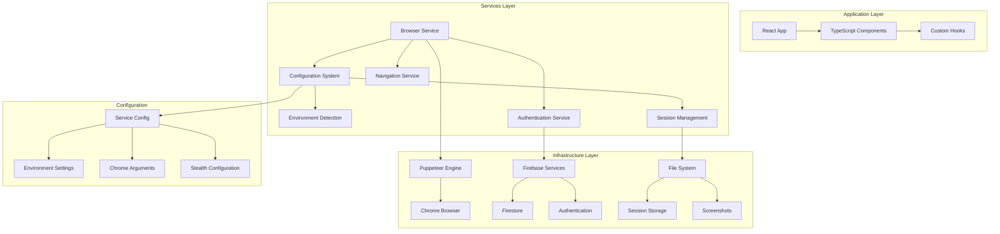
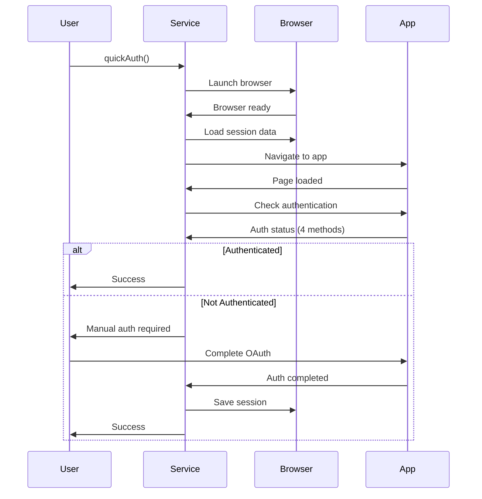

# Services Architecture Overview

## System Architecture

The Notecards application implements a professional services layer that provides automation, testing, and development capabilities with industry-standard patterns.



## Service Hierarchy

### 1. Universal Browser Service (`services/browser-service.mjs`)

**Purpose:** Professional browser automation with session management and authentication

**Key Responsibilities:**
- Browser lifecycle management (startup/shutdown)
- Session persistence (cookies, localStorage)
- Authentication handling with multiple verification methods
- Environment-aware configuration
- Resource cleanup and error recovery

**Public API:**
```javascript
// Simple API for common operations
await browserService.quickAuth()           // Quick authentication
await browserService.verifyAuthentication() // Check auth status
await browserService.startup()             // Get browser connection
await browserService.shutdown()            // Clean shutdown
```

**NPM Integration:**
```bash
npm run auth:quick    # Quick authentication setup
npm run auth:verify   # Verify authentication status
```

### 2. Configuration System (`src/config/service-config.mjs`)

**Purpose:** Environment-aware configuration management

**Key Features:**
- Environment detection (development/test/staging/production)
- Chrome launch arguments optimization
- Stealth plugin configuration
- Path management for session data
- Timeout and retry configuration

**Configuration Types:**
```javascript
const config = createBrowserConfig('development');
config.getAppUrl()        // -> http://127.0.0.1:5175
config.isAuthRequired()   // -> true
config.getAuthStrategy()  // -> 'manual'
```

## Environment Configuration

### Development Environment
```javascript
{
  environment: 'development',
  appUrl: 'http://127.0.0.1:5175',
  authRequired: true,
  authStrategy: 'manual',
  browser: {
    headless: false,
    stealth: true,
    userDataDir: './.browser-session/chrome-data'
  }
}
```

### Production Environment
```javascript
{
  environment: 'production', 
  appUrl: 'https://notecards-1b054.web.app',
  authRequired: true,
  authStrategy: 'session-restore',
  browser: {
    headless: true,
    stealth: true,
    userDataDir: './prod-session/chrome-data'
  }
}
```

## Session Management Architecture

### Session Data Structure
```javascript
{
  cookies: [
    {
      name: 'session_id',
      value: 'abc123',
      domain: '.notecards.app',
      path: '/',
      expires: 1625097600
    }
  ],
  localStorage: {
    'firebase:authUser:...': '{"uid":"123","email":"user@example.com"}',
    'app:preferences': '{"theme":"dark","language":"en"}'
  },
  authState: true,
  timestamp: '2025-09-08T12:00:00.000Z'
}
```

### Session Storage Locations
```
project-root/
├── .browser-session/
│   ├── cookies.json          # HTTP cookies
│   ├── storage.json          # localStorage data
│   └── chrome-data/          # Chrome user data directory
│       ├── Default/
│       │   ├── Preferences
│       │   ├── Local Storage/
│       │   └── Session Storage/
│       └── ...
```

### Session Lifecycle
1. **Initialization**: Load existing session data
2. **Navigation**: Restore cookies before page load
3. **Domain Load**: Restore localStorage after navigation
4. **Operations**: Maintain session state during automation
5. **Shutdown**: Save current session state for next run

## Authentication Architecture

### Multi-Method Verification System

The service uses four different methods to verify authentication:

```javascript
const authChecks = [
  // Method 1: Firebase Auth localStorage
  () => localStorage.getItem('firebase:authUser:...') !== null,
  
  // Method 2: User-specific content detection
  () => document.querySelector('[data-testid="user-menu"]') !== null,
  
  // Method 3: Authenticated UI elements
  () => document.querySelector('.authenticated') !== null,
  
  // Method 4: Absence of sign-in elements
  () => !document.querySelector('.sign-in-button')
];
```

### Authentication Flow


## Error Handling Strategy

### Error Categories and Recovery

1. **Browser Launch Errors**
   ```javascript
   try {
     await browserService.startup();
   } catch (error) {
     // Automatic retry with different Chrome paths
     // Fallback to bundled Chromium
     // Clear corrupted session data
   }
   ```

2. **Authentication Errors**
   ```javascript
   // Session corruption detection
   if (sessionCorrupted) {
     await clearSession();
     await startManualAuth();
   }
   ```

3. **Network Errors**
   ```javascript
   // Automatic retry with exponential backoff
   const retry = async (fn, attempts = 3) => {
     for (let i = 0; i < attempts; i++) {
       try {
         return await fn();
       } catch (error) {
         if (i === attempts - 1) throw error;
         await sleep(Math.pow(2, i) * 1000);
       }
     }
   };
   ```

4. **Resource Cleanup Errors**
   ```javascript
   // Always attempt cleanup even if errors occur
   try {
     await normalShutdown();
   } catch (error) {
     await forceCleanup();
   } finally {
     resetServiceState();
   }
   ```

## Performance Optimization

### Resource Efficiency
- **Singleton Pattern**: One browser instance shared across operations
- **Session Reuse**: Avoid re-authentication when possible
- **Lazy Loading**: Services initialize only when needed
- **Connection Pooling**: Reuse browser connections for multiple operations

### Memory Management
```javascript
// Automatic cleanup after operations
class BrowserService {
  async shutdown() {
    await this.saveSession();     // Persist session data
    await this.page?.close();     // Close page
    await this.browser?.close();  // Close browser
    this.resetState();            // Clear memory references
  }
}
```

### Startup Optimization
```javascript
// Fast startup for already-configured environments
async startup() {
  if (this.isInitialized && this.browser?.isConnected()) {
    return this.getConnection(); // Reuse existing connection
  }
  
  return this.initialize(); // Full initialization only when needed
}
```

## Integration Patterns

### Testing Integration
```javascript
// Services integrate seamlessly with test frameworks
describe('App Tests', () => {
  beforeAll(() => browserService.startup());
  afterAll(() => browserService.shutdown());
  
  test('should authenticate', async () => {
    const result = await browserService.verifyAuthentication();
    expect(result).toBe(true);
  });
});
```

### CI/CD Integration
```yaml
# GitHub Actions workflow
steps:
  - name: Setup Authentication
    run: npm run auth:quick
    
  - name: Run Tests
    run: npm test
    
  - name: Verify Deployment Auth
    run: npm run auth:verify
```

### Development Workflow
```javascript
// Development script example
async function developmentWorkflow() {
  // Quick setup
  const { browser, page } = await browserService.startup({ checkAuth: true });
  
  // Development tasks
  await page.goto('http://localhost:3000/admin');
  await page.screenshot({ path: 'admin-panel.png' });
  
  // Keep browser open for manual inspection
  console.log('Browser ready for manual use');
}
```

## Monitoring and Observability

### Service Health Checks
```javascript
const healthCheck = {
  service: browserService.isReady(),
  browser: browserService.browser?.isConnected(),
  authentication: await browserService.checkAuthenticationStatus(),
  session: await browserService.sessionExists(),
  timestamp: new Date().toISOString()
};
```

### Logging Standards
```javascript
// Structured logging with consistent format
console.log('🔍 Universal Browser Service Initialize called');
console.log('✅ Browser launched successfully');
console.log('⚠️  Session data corrupted, regenerating');
console.log('❌ Authentication failed after 3 attempts');
```

### Metrics Collection
```javascript
const metrics = {
  startupTime: Date.now() - startTime,
  authenticationAttempts: 2,
  sessionRestoreSuccess: true,
  errorsEncountered: 0,
  operationsCompleted: 5
};
```

## Security Considerations

### Session Security
- Session data stored locally with appropriate file permissions
- No sensitive credentials stored in session files
- Session invalidation on security events
- Environment-specific session isolation

### Browser Security
- Stealth configuration to avoid detection
- Isolated user data directories per environment
- Automatic cleanup of sensitive data
- Secure defaults for Chrome security settings

### Authentication Security
- OAuth flow handled by Google's secure endpoints
- No credential storage in service code
- Session timeout and automatic renewal
- Multi-factor authentication support

## Future Roadmap

### Planned Enhancements

1. **Service Registry**
   - Central service discovery and management
   - Health monitoring across all services
   - Dependency injection for service composition

2. **Advanced Session Management**
   - Encrypted session storage
   - Cross-device session synchronization
   - Session analytics and insights

3. **Performance Monitoring**
   - Automatic performance metrics collection
   - Lighthouse integration for performance testing
   - Resource usage optimization

4. **Cloud Integration**
   - Docker containerization for services
   - Kubernetes deployment manifests
   - Cloud provider integration (AWS, GCP, Azure)

### Service Expansion

1. **Screenshot Service**: Automated visual regression testing
2. **Performance Service**: Lighthouse automation and monitoring
3. **Data Service**: Database operations and data management
4. **Notification Service**: Multi-channel notification system
5. **Deployment Service**: Automated deployment workflows

---

This architecture provides a solid foundation for scalable, maintainable automation services while following industry best practices for configuration, error handling, and resource management.
