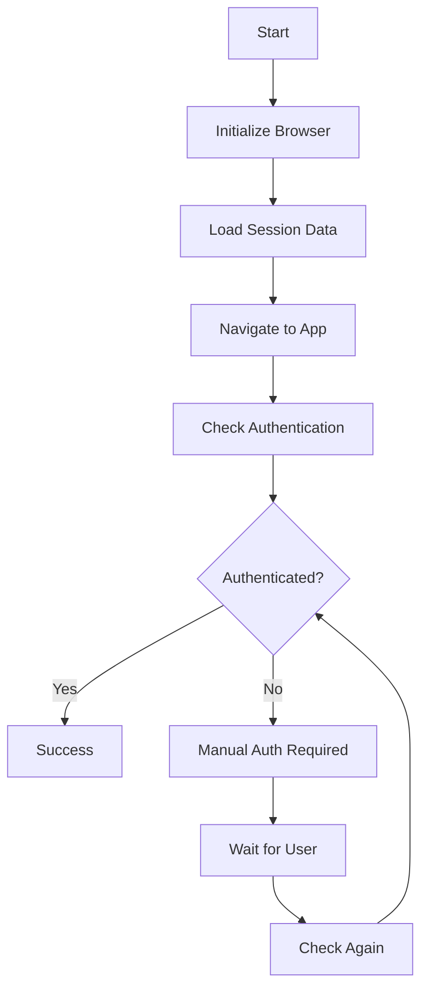

# Browser Service API Documentation

## Overview

The Universal Browser Service is a professional singleton service that provides browser automation capabilities with environment-aware configuration, session management, and authentication handling.

## Table of Contents

- [Quick Start](#quick-start)
- [API Reference](#api-reference)
- [Configuration](#configuration)
- [Authentication](#authentication)
- [Session Management](#session-management)
- [Error Handling](#error-handling)
- [Examples](#examples)
- [Best Practices](#best-practices)

## Quick Start

### Installation

The browser service is included in the project services. Import and use:

```javascript
import browserService from './services/browser-service.mjs';
```

### Simple Usage

```javascript
// Quick authentication
const authenticated = await browserService.quickAuth();

// Verify authentication status
const isAuthenticated = await browserService.verifyAuthentication();

// Custom automation
const { browser, page } = await browserService.startup();
await page.goto('https://example.com');
await browserService.shutdown();
```

### NPM Scripts

```bash
# Quick authentication setup
npm run auth:quick

# Verify current authentication status  
npm run auth:verify
```

## API Reference

### Core Methods

#### `quickAuth(url?: string): Promise<boolean>`

Performs quick authentication setup with minimal configuration.

**Parameters:**
- `url` (optional): Target URL to authenticate against. Defaults to configured app URL.

**Returns:** Promise that resolves to `true` if authentication successful, `false` otherwise.

**Example:**
```javascript
// Quick auth with default URL
const result = await browserService.quickAuth();

// Quick auth with custom URL
const result = await browserService.quickAuth('http://localhost:3000');
```

---

#### `verifyAuthentication(): Promise<boolean>`

Verifies current authentication status and closes browser.

**Returns:** Promise that resolves to `true` if authenticated, `false` otherwise.

**Example:**
```javascript
const isAuthenticated = await browserService.verifyAuthentication();
console.log(isAuthenticated ? '✅ Authenticated' : '❌ Not authenticated');
```

---

#### `startup(options?: StartupOptions): Promise<StartupResult>`

Starts up the browser service and returns connection details.

**Parameters:**
- `options.checkAuth` (boolean): Whether to check authentication status
- `options.url` (string): Optional target URL

**Returns:** Promise that resolves to startup result object.

**StartupResult Type:**
```typescript
interface StartupResult {
  ready: boolean;
  authenticated: boolean;
  browser: Browser;
  page: Page;
}
```

**Example:**
```javascript
const result = await browserService.startup({ checkAuth: true });
if (result.ready) {
  const { browser, page } = browserService.getBrowser();
  // Use browser and page for automation
}
```

---

#### `shutdown(): Promise<boolean>`

Cleanly shuts down the browser service with session saving.

**Returns:** Promise that resolves to `true` if shutdown successful.

**Example:**
```javascript
const success = await browserService.shutdown();
console.log('Shutdown successful:', success);
```

---

#### `getBrowser(): {browser: Browser, page: Page}`

Gets the current browser and page instances.

**Returns:** Object with browser and page references.

**Throws:** Error if service not initialized.

**Example:**
```javascript
await browserService.startup();
const { browser, page } = browserService.getBrowser();
await page.click('#my-button');
```

---

#### `isReady(): boolean`

Checks if the service is ready for use.

**Returns:** `true` if browser is initialized and connected.

**Example:**
```javascript
if (browserService.isReady()) {
  // Safe to use browser
}
```

### Authentication Methods

#### `checkAuthenticationStatus(): Promise<boolean>`

Comprehensive authentication check using multiple verification methods.

**Verification Methods:**
1. Firebase Auth localStorage check
2. User-specific content detection
3. Authenticated UI elements
4. Absence of sign-in elements

**Returns:** Promise that resolves to authentication status.

**Example:**
```javascript
const isAuth = await browserService.checkAuthenticationStatus();
console.log('Authentication methods passed: 3/4');
```

#### `setupAuthentication(url?: string): Promise<boolean>`

Handles authentication setup with user guidance.

**Parameters:**
- `url` (optional): Target URL for authentication

**Returns:** Promise that resolves to authentication success.

### Session Management

#### `saveSession(): Promise<void>`

Saves current browser session data (cookies and localStorage).

**Session Data Location:**
- Cookies: `.browser-session/cookies.json`
- LocalStorage: `.browser-session/storage.json`
- Chrome Data: `.browser-session/chrome-data/`

#### `loadSession(): Promise<void>`

Loads saved session data (cookies only - localStorage loaded after navigation).

#### `loadStorageAfterNavigation(): Promise<void>`

Loads localStorage data after navigating to target domain.

### Navigation

#### `navigateToApp(options?: NavigationOptions): Promise<void>`

Navigates to the configured application URL.

**Parameters:**
- `options.appUrl`: Override target URL
- `options.waitForAuth`: Whether to wait for authentication

**Example:**
```javascript
await browserService.navigateToApp({
  appUrl: 'http://localhost:5175',
  waitForAuth: true
});
```

## Configuration

The service uses environment-aware configuration:

### Environment Types
- `development`: Local development (http://127.0.0.1:5175)
- `test`: Testing environment  
- `staging`: Staging environment
- `production`: Production environment (https://notecards-1b054.web.app)

### Configuration Example
```javascript
import { createBrowserConfig, SERVICE_TYPE } from '../src/config/service-config.mjs';

const config = createBrowserConfig('development');
console.log('App URL:', config.getAppUrl());
console.log('Auth required:', config.isAuthRequired());
```

## Authentication

### Authentication Strategies

1. **Manual Authentication**: User manually signs in through browser
2. **Session Restore**: Automatic session restoration from saved data
3. **Skip Authentication**: For environments that don't require auth

### Authentication Flow



### Authentication Verification

The service uses multiple methods to verify authentication:

```javascript
// Method 1: Firebase Auth localStorage
const authData = localStorage.getItem('firebase:authUser:...');

// Method 2: User content detection  
const userElements = document.querySelector('[data-testid="user-menu"]');

// Method 3: Authenticated UI elements
const authUI = document.querySelector('.authenticated');

// Method 4: Absence of sign-in elements
const noSignIn = !document.querySelector('.sign-in-button');
```

## Error Handling

### Common Error Scenarios

1. **Browser Launch Failure**
   ```javascript
   try {
     await browserService.startup();
   } catch (error) {
     console.error('Browser failed to start:', error.message);
   }
   ```

2. **Authentication Timeout**
   ```javascript
   const result = await browserService.quickAuth();
   if (!result) {
     console.log('Authentication failed or timed out');
   }
   ```

3. **Session Corruption**
   ```javascript
   // Service automatically handles session errors
   // and falls back to manual authentication
   ```

### Error Recovery

The service includes automatic error recovery:
- Session data corruption handling
- Browser crash recovery
- Network failure resilience
- Graceful timeout handling

## Examples

### Example 1: Simple Authentication Check

```javascript
import browserService from './services/browser-service.mjs';

async function checkAuth() {
  try {
    const isAuthenticated = await browserService.verifyAuthentication();
    
    if (isAuthenticated) {
      console.log('✅ User is authenticated');
      return true;
    } else {
      console.log('❌ User needs to authenticate');
      return false;
    }
  } catch (error) {
    console.error('Authentication check failed:', error);
    return false;
  }
}

checkAuth();
```

### Example 2: Custom Automation Workflow

```javascript
import browserService from './services/browser-service.mjs';

async function automateTask() {
  try {
    // Start browser service
    const startup = await browserService.startup({ checkAuth: true });
    
    if (!startup.ready) {
      throw new Error('Failed to start browser service');
    }
    
    if (!startup.authenticated) {
      console.log('Authentication required...');
      const authResult = await browserService.quickAuth();
      if (!authResult) {
        throw new Error('Authentication failed');
      }
    }
    
    // Get browser connection
    const { browser, page } = browserService.getBrowser();
    
    // Perform automation tasks
    await page.click('#my-button');
    await page.type('#input-field', 'Hello World');
    
    // Take screenshot
    await page.screenshot({ path: 'automation-result.png' });
    
    console.log('✅ Automation completed successfully');
    
  } catch (error) {
    console.error('❌ Automation failed:', error);
  } finally {
    // Always clean up
    await browserService.shutdown();
  }
}

automateTask();
```

### Example 3: Test Integration

```javascript
import browserService from './services/browser-service.mjs';

describe('App Tests', () => {
  beforeAll(async () => {
    await browserService.startup();
  });
  
  afterAll(async () => {
    await browserService.shutdown();
  });
  
  test('should navigate to app', async () => {
    const { page } = browserService.getBrowser();
    await page.goto('http://localhost:3000');
    
    const title = await page.title();
    expect(title).toBe('My App');
  });
  
  test('should handle authentication', async () => {
    const isAuth = await browserService.checkAuthenticationStatus();
    expect(typeof isAuth).toBe('boolean');
  });
});
```

## Best Practices

### 1. Always Clean Up Resources

```javascript
try {
  await browserService.startup();
  // ... automation code
} finally {
  await browserService.shutdown(); // Always clean up
}
```

### 2. Check Ready State

```javascript
if (!browserService.isReady()) {
  await browserService.startup();
}
```

### 3. Handle Authentication Gracefully

```javascript
const startup = await browserService.startup({ checkAuth: true });
if (!startup.authenticated) {
  console.log('Please complete authentication in the browser window');
  const authResult = await browserService.quickAuth();
}
```

### 4. Use Environment Configuration

```javascript
// Let the service auto-detect environment
const result = await browserService.startup();

// Or specify environment explicitly
const service = new BrowserService('production');
```

### 5. Error Handling

```javascript
try {
  const result = await browserService.verifyAuthentication();
  return result;
} catch (error) {
  console.error('Service error:', error.message);
  // Implement fallback logic
  return false;
}
```

### 6. Session Management

```javascript
// Sessions are automatically managed
// But you can force save if needed
await browserService.saveSession();
```

## Troubleshooting

### Common Issues

1. **"Service not initialized" Error**
   - Solution: Call `startup()` before using browser methods

2. **Authentication Detection False Negatives**
   - Solution: The service uses multiple checks; may need to adjust selectors

3. **Browser Won't Close**
   - Solution: Always call `shutdown()` instead of manual browser.close()

4. **Session Not Restoring**
   - Solution: Check that `.browser-session/` directory has proper permissions

### Debug Mode

Enable debug logging by checking the console output:
- ✅ marks successful operations
- ⚠️ marks warnings
- ❌ marks errors
- 🔍 marks authentication checks

## Version History

- **v2.0.0** - Professional service architecture with configuration system
- **v1.5.0** - Added multiple authentication verification methods
- **v1.0.0** - Initial implementation with basic session management

## Support

For issues or questions:
1. Check the troubleshooting section
2. Review console logs for detailed error information
3. Ensure proper environment configuration
4. Verify Chrome is installed and accessible
