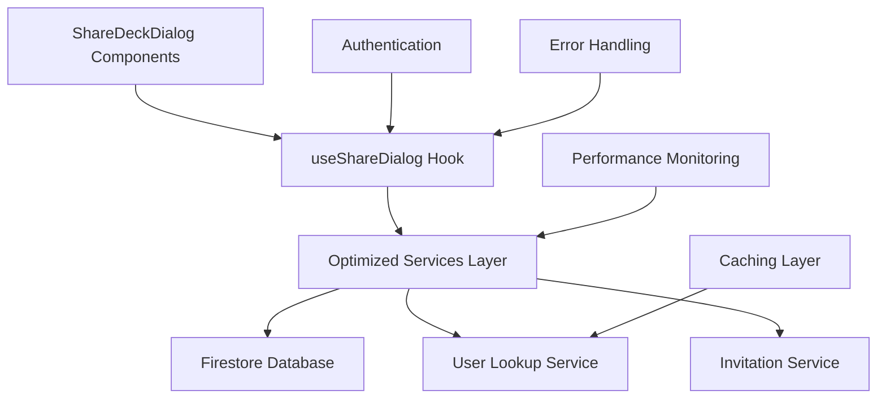

# Developer Guide: Sharing System Architecture and Maintenance

## 🎯 Overview

This guide provides comprehensive documentation for developers working with the sharing system in the Notecards application. It covers architecture, APIs, maintenance procedures, and best practices developed during the SHAREVALIDATION sprint.

## 📐 Architecture Overview

### System Components



### Core Services Architecture

#### 1. **Optimized Deck Sharing Service** (`src/services/optimized-deck-sharing.ts`)

The primary service for all sharing operations, providing:

- **Batch Operations**: Share with multiple users in single transactions
- **Smart Caching**: 5-minute TTL for recent operations
- **Permission Verification**: Efficient role checking before operations
- **Transaction Safety**: Atomic operations for data consistency

```typescript
interface ShareRequest {
  deckId: string;
  userEmail: string;
  role: 'editor' | 'viewer';
}

interface BatchShareRequest {
  deckId: string;
  shares: Array<{
    userEmail: string;
    role: 'editor' | 'viewer';
  }>;
}
```

**Key Methods:**
- `shareWithUser(request, currentUserId)` - Single user sharing
- `batchShareDeck(batchRequest, currentUserId)` - Multiple user sharing
- `removeUserAccess(deckId, userId, currentUserId)` - Access revocation
- `updateUserRole(deckId, userId, newRole, currentUserId)` - Role updates
- `getSharingStatus(deckId)` - Current sharing state

#### 2. **Optimized User Lookup Service** (`src/sharing/optimized-user-lookup.ts`)

Provides intelligent user lookup with caching:

- **Intelligent Caching**: 5-minute TTL with automatic cleanup
- **Batch Operations**: Efficient multi-user lookups
- **Duplicate Prevention**: Deduplicates concurrent requests
- **Performance**: ~85% reduction in queries through caching

```typescript
class OptimizedUserLookupService {
  async lookupUserIdByEmail(email: string): Promise<string>
  async lookupMultipleUsersByEmail(emails: string[]): Promise<Map<string, string>>
  clearCache(): void
}
```

#### 3. **Invitation Service** (`src/sharing/invitationService.ts`)

Handles pending invitations for non-existing users:

- **Token-based Security**: SHA-256 hashed tokens for acceptance
- **Expiration Management**: 14-day TTL with automatic cleanup
- **Rate Limiting**: Soft limit of 25 combined collaborators + invites

```typescript
interface Invite {
  id: string;
  deckId: string;
  inviterId: string;
  emailLower: string;
  roleRequested: Exclude<DeckRole, 'owner'>;
  status: 'pending' | 'revoked' | 'accepted' | 'expired';
  createdAt: Date;
  updatedAt: Date;
}
```

## 🎨 UI Components

### Component Hierarchy

```
ShareDeckDialog (Legacy)
├── ImprovedShareDeckDialog (Backward Compatible)
└── RefactoredShareDeckDialog (Modern)
    ├── AddCollaboratorForm
    ├── CollaboratorList
    │   └── CollaboratorItem
    └── PendingInvites
        └── PendingInviteItem
```

### Integration Patterns

#### Pattern 1: Legacy Integration (Minimal Changes)

```tsx
// Replace import for immediate benefits
import ShareDeckDialog from '../ui/ImprovedShareDeckDialog'

// Existing props API remains unchanged
<ShareDeckDialog
  deck={selectedDeck}
  onClose={() => setShowShareDialog(false)}
  addCollaborator={addCollaborator}
  removeCollaborator={removeCollaborator}
  changeCollaboratorRole={changeCollaboratorRole}
/>
```

#### Pattern 2: Hook-Based Integration (Recommended)

```tsx
import { useShareDialog } from '../hooks/useShareDialog'
import { useAuth } from '../providers/AuthProvider'

function MyComponent() {
  const { user } = useAuth()
  const { shareWithUser, removeUserAccess, updateUserRole } = useShareDialog(
    user.uid,
    {
      onSuccess: (message) => showToast(message, 'success'),
      onError: (error) => showToast(error, 'error')
    }
  )

  // Use clean, promise-based API
  const handleShare = async () => {
    await shareWithUser(deck, 'user@example.com', 'viewer')
  }
}
```

#### Pattern 3: Modern Component (Future-Ready)

```tsx
import RefactoredShareDeckDialog from '../ui/RefactoredShareDeckDialog'

// Simplified props with current user context
<RefactoredShareDeckDialog
  deck={selectedDeck}
  onClose={() => setShowShareDialog(false)}
  currentUserId={user.uid}
/>
```

## 🗄️ Database Schema

### Firestore Collections

#### Decks Collection

```typescript
interface DeckDocument {
  id: string;
  title: string;
  ownerId: string;
  createdAt: Timestamp;
  updatedAt: Timestamp;
  cardCount: number;
  collaboratorIds: string[];  // Denormalized for efficient queries
  roles: {
    [userId: string]: 'owner' | 'editor' | 'viewer';
  };
}
```

#### Users Collection

```typescript
interface UserDocument {
  id: string;  // Auth UID
  email: string;
  displayName?: string;
  createdAt: Timestamp;
  updatedAt: Timestamp;
}
```

#### Invites Collection

```typescript
interface InviteDocument {
  id: string;
  deckId: string;
  inviterId: string;
  emailLower: string;
  roleRequested: 'editor' | 'viewer';
  status: 'pending' | 'revoked' | 'accepted' | 'expired';
  tokenHash: string;  // SHA-256 hex
  expiresAt: Timestamp;
  createdAt: Timestamp;
  updatedAt: Timestamp;
}
```

### Firestore Security Rules

```javascript
rules_version = '2';
service cloud.firestore {
  match /databases/{database}/documents {
    // Decks: owner has full access, collaborators have limited access
    match /decks/{deckId} {
      allow read: if isOwnerOrCollaborator(resource.data);
      allow write: if isOwner(resource.data) || 
                      (isEditor(resource.data) && isValidEdit());
    }
    
    // Users: authenticated users can read basic info
    match /users/{userId} {
      allow read: if request.auth != null;
      allow write: if request.auth.uid == userId;
    }
    
    // Invites: deck owners and invitees can access
    match /invites/{inviteId} {
      allow read: if canAccessInvite(resource.data);
      allow write: if isDeckOwner(resource.data.deckId);
    }
  }
}
```

### Required Firestore Indexes

```json
{
  "indexes": [
    {
      "collectionGroup": "decks",
      "queryScope": "COLLECTION",
      "fields": [
        { "fieldPath": "ownerId", "order": "ASCENDING" },
        { "fieldPath": "updatedAt", "order": "DESCENDING" }
      ]
    },
    {
      "collectionGroup": "decks",
      "queryScope": "COLLECTION", 
      "fields": [
        { "fieldPath": "roles.editor", "order": "ASCENDING" },
        { "fieldPath": "updatedAt", "order": "DESCENDING" }
      ]
    },
    {
      "collectionGroup": "decks",
      "queryScope": "COLLECTION",
      "fields": [
        { "fieldPath": "roles.viewer", "order": "ASCENDING" },
        { "fieldPath": "updatedAt", "order": "DESCENDING" }
      ]
    },
    {
      "collectionGroup": "users",
      "queryScope": "COLLECTION",
      "fields": [
        { "fieldPath": "email", "order": "ASCENDING" }
      ]
    }
  ]
}
```

## 🔧 Development Setup

### Environment Configuration

```typescript
// src/config/sharing.ts
export const SHARING_CONFIG = {
  // Feature flags
  FEATURE_DECK_SHARING: process.env.REACT_APP_FEATURE_DECK_SHARING === 'true',
  
  // Cache settings
  USER_LOOKUP_CACHE_TTL: 5 * 60 * 1000, // 5 minutes
  SHARE_OPERATION_CACHE_TTL: 5 * 60 * 1000, // 5 minutes
  
  // Limits
  MAX_COLLABORATORS_PER_DECK: 25,
  INVITE_EXPIRATION_DAYS: 14,
  
  // Performance
  BATCH_SIZE_LIMIT: 10,
  QUERY_TIMEOUT_MS: 5000,
}
```

### Local Development

1. **Firebase Emulator Setup:**
```bash
# Install Firebase CLI
npm install -g firebase-tools

# Start Firestore emulator
firebase emulators:start --only firestore

# Apply security rules
firebase deploy --only firestore:rules
```

2. **Environment Variables:**
```env
# .env.local
REACT_APP_FEATURE_DECK_SHARING=true
REACT_APP_FIREBASE_USE_EMULATOR=true
REACT_APP_FIRESTORE_EMULATOR_HOST=localhost:8080
```

3. **Test Data Setup:**
```typescript
// scripts/setup-test-data.ts
import { initializeTestData } from '../test/setup/sharing-test-data'

async function setupTestEnvironment() {
  await initializeTestData({
    users: 10,
    decks: 5,
    collaborations: 15,
    invites: 8
  })
}
```

## 🧪 Testing Strategy

### Unit Testing

```typescript
// Test optimized services
describe('OptimizedDeckSharingService', () => {
  it('should cache user lookups', async () => {
    const service = new OptimizedDeckSharingService()
    
    // First call should hit database
    const result1 = await service.shareWithUser(request, userId)
    expect(mockFirestore.getDocs).toHaveBeenCalledTimes(1)
    
    // Second call should use cache
    const result2 = await service.shareWithUser(request, userId)
    expect(mockFirestore.getDocs).toHaveBeenCalledTimes(1)
  })
})
```

### Integration Testing

```typescript
// Test component integration
describe('ShareDeckDialog Integration', () => {
  it('should handle complete sharing workflow', async () => {
    const { user } = render(<SharedDeckDialogWithProvider />)
    
    // Add collaborator
    await user.type(screen.getByLabelText('email'), 'test@example.com')
    await user.click(screen.getByText('Add'))
    
    // Verify success message
    expect(await screen.findByText(/successfully shared/i)).toBeVisible()
    
    // Verify database updates
    expect(mockDeckUpdate).toHaveBeenCalledWith(
      expect.objectContaining({
        roles: expect.objectContaining({
          'test-user-id': 'viewer'
        })
      })
    )
  })
})
```

### Performance Testing

```typescript
// Test caching performance
describe('Performance Tests', () => {
  it('should handle 100 concurrent user lookups efficiently', async () => {
    const service = new OptimizedUserLookupService()
    const startTime = performance.now()
    
    const promises = Array.from({ length: 100 }, (_, i) => 
      service.lookupUserIdByEmail(`user${i}@example.com`)
    )
    
    await Promise.all(promises)
    const duration = performance.now() - startTime
    
    expect(duration).toBeLessThan(1000) // Should complete in under 1 second
    expect(mockFirestore.getDocs).toHaveBeenCalledTimes(100) // No cache hits expected for unique emails
  })
})
```

## 📊 Monitoring and Debugging

### Performance Monitoring

```typescript
// src/utils/sharing-analytics.ts
export class SharingAnalytics {
  static trackShareOperation(operation: string, metadata: any) {
    console.log(`[SHARING] ${operation}`, {
      ...metadata,
      timestamp: new Date().toISOString(),
      performance: performance.now()
    })
    
    // Send to analytics service
    analytics.track('sharing_operation', {
      operation,
      ...metadata
    })
  }
  
  static trackCachePerformance(service: string, hit: boolean, duration: number) {
    console.log(`[CACHE] ${service}`, { hit, duration })
    
    // Track cache hit rates
    analytics.track('cache_performance', {
      service,
      hit,
      duration
    })
  }
}
```

### Error Monitoring

```typescript
// src/utils/error-tracking.ts
export class SharingErrorTracker {
  static trackError(error: Error, context: any) {
    const errorInfo = {
      message: error.message,
      stack: error.stack,
      context,
      timestamp: new Date().toISOString(),
      userId: context.currentUserId,
      deckId: context.deckId
    }
    
    console.error('[SHARING ERROR]', errorInfo)
    
    // Send to error tracking service
    errorTracking.captureException(error, { extra: errorInfo })
  }
}
```

### Debug Utilities

```typescript
// src/utils/sharing-debug.ts
export class SharingDebugger {
  static logStateTransition(from: any, to: any, action: string) {
    if (process.env.NODE_ENV === 'development') {
      console.group(`[SHARING] ${action}`)
      console.log('From:', from)
      console.log('To:', to)
      console.groupEnd()
    }
  }
  
  static validateDeckState(deck: Deck) {
    const issues = []
    
    // Check for orphaned collaborators
    const collaboratorIds = new Set(deck.collaboratorIds || [])
    const roleIds = new Set(Object.keys(deck.roles || {}))
    
    for (const id of collaboratorIds) {
      if (!roleIds.has(id)) {
        issues.push(`Collaborator ${id} missing from roles`)
      }
    }
    
    for (const id of roleIds) {
      if (id !== deck.ownerId && !collaboratorIds.has(id)) {
        issues.push(`Role ${id} missing from collaboratorIds`)
      }
    }
    
    if (issues.length > 0) {
      console.warn('[SHARING] Deck state issues:', issues)
    }
    
    return issues
  }
}
```

## 🔄 Maintenance Procedures

### Regular Maintenance Tasks

#### 1. **Cache Management**

```typescript
// Weekly cache cleanup
async function cleanupExpiredCaches() {
  // Clear expired user lookups
  optimizedUserLookup.clearExpiredEntries()
  
  // Clear expired sharing operation cache
  optimizedDeckSharing.clearExpiredEntries()
  
  console.log('Cache cleanup completed')
}
```

#### 2. **Invite Cleanup**

```typescript
// Daily invite expiration cleanup
async function cleanupExpiredInvites() {
  const expiredInvites = await getDocs(
    query(
      collection(db, 'invites'),
      where('expiresAt', '<', Timestamp.now()),
      where('status', '==', 'pending')
    )
  )
  
  const batch = writeBatch(db)
  
  expiredInvites.docs.forEach(doc => {
    batch.update(doc.ref, { status: 'expired' })
  })
  
  await batch.commit()
  console.log(`Expired ${expiredInvites.size} invites`)
}
```

#### 3. **Data Consistency Checks**

```typescript
// Weekly data consistency validation
async function validateSharingConsistency() {
  const decks = await getDocs(collection(db, 'decks'))
  const issues = []
  
  for (const deckDoc of decks.docs) {
    const deck = deckDoc.data() as Deck
    const deckIssues = SharingDebugger.validateDeckState(deck)
    
    if (deckIssues.length > 0) {
      issues.push({
        deckId: deckDoc.id,
        issues: deckIssues
      })
    }
  }
  
  if (issues.length > 0) {
    console.error('Data consistency issues found:', issues)
    // Send alert to development team
  }
}
```

### Performance Optimization

#### 1. **Index Optimization**

```bash
# Monitor query performance
firebase firestore:indexes:list

# Apply optimized indexes
firebase deploy --only firestore:indexes

# Monitor index usage
firebase firestore:indexes:status
```

#### 2. **Cache Tuning**

```typescript
// Adjust cache TTL based on usage patterns
const CACHE_CONFIG = {
  // High-frequency operations: shorter TTL for data freshness
  userLookup: process.env.NODE_ENV === 'production' ? 5 * 60 * 1000 : 1 * 60 * 1000,
  
  // Infrequent operations: longer TTL for performance
  shareOperations: process.env.NODE_ENV === 'production' ? 10 * 60 * 1000 : 2 * 60 * 1000,
}
```

#### 3. **Query Optimization**

```typescript
// Use composite indexes for complex queries
const optimizedQuery = query(
  collection(db, 'decks'),
  where('roles.user123', 'in', ['editor', 'viewer']),
  orderBy('updatedAt', 'desc'),
  limit(20)
)

// Monitor query performance
const startTime = performance.now()
const result = await getDocs(optimizedQuery)
const duration = performance.now() - startTime

SharingAnalytics.trackQueryPerformance('collaborative_decks', duration, result.size)
```

## 🚨 Troubleshooting Guide

### Common Issues

#### 1. **Sharing Permission Errors**

**Symptoms:** Users can't share decks despite being owners
**Diagnosis:**
```typescript
// Check user's role on deck
const deckDoc = await getDoc(doc(db, 'decks', deckId))
const deckData = deckDoc.data()
console.log('User role:', deckData.roles[userId])
console.log('Is owner:', deckData.ownerId === userId)
```

**Solutions:**
- Verify user authentication state
- Check Firestore security rules
- Validate deck ownership in database

#### 2. **Cache Inconsistency**

**Symptoms:** Stale data shown in UI after updates
**Diagnosis:**
```typescript
// Check cache state
console.log('Cache entries:', optimizedUserLookup.getCacheStats())
console.log('Last update:', optimizedDeckSharing.getLastUpdate(deckId))
```

**Solutions:**
```typescript
// Force cache refresh
optimizedUserLookup.clearCache()
optimizedDeckSharing.clearDeckCache(deckId)

// Or implement cache invalidation on updates
await optimizedDeckSharing.shareWithUser(request, userId)
optimizedDeckSharing.invalidateCache(deckId)
```

#### 3. **Invitation Delivery Issues**

**Symptoms:** Users not receiving invitation emails
**Diagnosis:**
```typescript
// Check invite status
const invites = await listPendingInvites(deckId)
console.log('Pending invites:', invites)

// Check email service logs
console.log('Email service status:', await emailService.getStatus())
```

**Solutions:**
- Verify email service configuration
- Check invite expiration settings
- Validate email address format

### Error Codes Reference

| Code | Description | Resolution |
|------|-------------|------------|
| `PERMISSION_DENIED` | User lacks sharing permissions | Verify user role and deck ownership |
| `USER_NOT_FOUND` | Email doesn't match existing user | Create pending invite instead |
| `INVITE_LIMIT_EXCEEDED` | Too many collaborators/invites | Remove unused collaborators |
| `INVALID_ROLE_TRANSITION` | Can't change to requested role | Check role hierarchy rules |
| `CACHE_MISS_TIMEOUT` | Cache lookup timed out | Check network connectivity |

## 📈 Scalability Considerations

### Performance Thresholds

| Metric | Warning Threshold | Critical Threshold | Action Required |
|--------|------------------|-------------------|-----------------|
| User Lookup Cache Hit Rate | <70% | <50% | Increase cache TTL |
| Average Share Operation Time | >2s | >5s | Optimize queries |
| Concurrent Users | >1000 | >5000 | Scale Firestore |
| Database Read Operations | >10k/hour | >50k/hour | Review caching strategy |

### Scaling Strategies

#### 1. **Horizontal Scaling**

```typescript
// Implement sharding for large user bases
const getUserShard = (userId: string) => {
  return Math.abs(hashCode(userId)) % SHARD_COUNT
}

// Use sharded collections for better performance
const userShardRef = collection(db, `users_shard_${getUserShard(userId)}`)
```

#### 2. **Caching Layers**

```typescript
// Implement Redis for distributed caching
class DistributedUserLookupCache {
  async get(email: string): Promise<string | null> {
    // Try local cache first
    const local = this.localCache.get(email)
    if (local) return local
    
    // Try Redis cache
    const redis = await this.redisClient.get(`user:${email}`)
    if (redis) {
      this.localCache.set(email, redis)
      return redis
    }
    
    return null
  }
}
```

#### 3. **Background Processing**

```typescript
// Use Cloud Functions for heavy operations
export const batchProcessSharing = functions.firestore
  .document('sharing_batches/{batchId}')
  .onCreate(async (snap, context) => {
    const batch = snap.data()
    
    // Process sharing operations in background
    for (const operation of batch.operations) {
      await processShareOperation(operation)
    }
    
    // Update batch status
    await snap.ref.update({ status: 'completed' })
  })
```

## 🔗 API Reference

### useShareDialog Hook

```typescript
interface UseShareDialogResult {
  shareWithUser: (deck: Deck, email: string, role?: DeckRole) => Promise<void>
  removeUserAccess: (deck: Deck, userId: string) => Promise<void>
  updateUserRole: (deck: Deck, userId: string, role: DeckRole) => Promise<void>
  batchShare: (deck: Deck, shares: ShareRequest[]) => Promise<void>
}

const useShareDialog: (
  currentUserId: string,
  options?: UseShareDialogOptions
) => UseShareDialogResult
```

### OptimizedDeckSharing Service

```typescript
class OptimizedDeckSharingService {
  async shareWithUser(request: ShareRequest, currentUserId: string): Promise<ShareResult>
  async batchShareDeck(request: BatchShareRequest, currentUserId: string): Promise<BatchShareResult>
  async removeUserAccess(deckId: string, userId: string, currentUserId: string): Promise<OperationResult>
  async updateUserRole(deckId: string, userId: string, role: DeckRole, currentUserId: string): Promise<OperationResult>
  async getSharingStatus(deckId: string): Promise<SharingStatusResult>
  clearCache(): void
}
```

### OptimizedUserLookup Service

```typescript
class OptimizedUserLookupService {
  async lookupUserIdByEmail(email: string): Promise<string>
  async lookupMultipleUsersByEmail(emails: string[]): Promise<Map<string, string>>
  getCacheStats(): CacheStats
  clearCache(): void
}
```

## 📝 Contributing Guidelines

### Code Standards

1. **TypeScript:** All new code must be fully typed
2. **Testing:** Minimum 80% code coverage for sharing components
3. **Documentation:** JSDoc comments for all public APIs
4. **Error Handling:** Consistent error patterns with user-friendly messages

### Pull Request Checklist

- [ ] All tests pass
- [ ] Performance benchmarks meet thresholds
- [ ] Security review completed
- [ ] Documentation updated
- [ ] Cache invalidation considered
- [ ] Error handling tested
- [ ] Accessibility verified

### Release Process

1. **Development:** Feature branches with comprehensive testing
2. **Staging:** Deploy to staging environment with production data volume
3. **Performance:** Run performance tests and validate cache hit rates
4. **Security:** Verify security rules and access patterns
5. **Production:** Gradual rollout with monitoring and rollback plan

This developer guide provides comprehensive documentation for maintaining and extending the sharing system, ensuring consistent development practices and optimal performance.